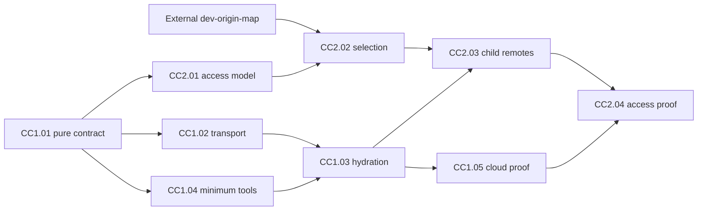

# EPIC: Codex Cloud treats Foresight as one self-hydrating workspace

## Outcome

A published Codex Cloud environment can use `open-hax/foresight` as the
workspace root without manually selecting every Foresight child merely to make
the source tree exist. Foresight prepares the minimum bootstrap tooling,
reconstructs its direct repository constellation from exact committed gitlinks,
and proves source checkout plus the named root gates before task execution.
Building/testing each independent child remains a separately selected action.

The root remains the orchestrator. Direct children remain independently owned
repositories. Nested repositories do not silently become Foresight workspace
roots.

## Context

- Current [Codex Cloud environments](https://learn.chatgpt.com/docs/environments/cloud-environments)
  combine repositories, tools, dependencies, and access settings in a published
  reusable setup. Environment inclusion and account repository permission are
  separate requirements for provider operations.
- [Legacy environments](https://learn.chatgpt.com/docs/environments/cloud-environment)
  still support Code Review and GitHub/Linear integrations. The current cloud
  environment proof in this epic is not automatically a legacy review setup
  proof or a remedy for exhausted review usage. Guidance checked 2026-10-04.
- Foresight already declares the physical source graph in `.gitmodules`, the
  semantic source graph in `src/foresight/project.cljc`, and the ownership
  boundary in `AGENTS.md`.
- The current README already routes a new actor through
  `git submodule update --init`, `project validate`, `guide`, and
  `workspace inventory`.
- Most direct GitHub submodules currently use SSH URLs. A clean managed cloud VM
  must not depend on the operator's local SSH agent being present.
- Foresight intentionally treats direct `.gitmodules` entries as workspace
  repositories and does not recursively promote nested Git repositories.

## Core identity

**Codex selects Foresight; Foresight reconstructs Foresight.**

The Codex environment is responsible for providing a clean execution host and
authorized repository connections. The Foresight root is responsible for
declaring and validating the suite topology.

## First executable story

**CC1.01 is the starting story.** Its only code dependencies are the current
root project model, project law, manifest parser, and NBB tests. It creates
pure bootstrap plan/assessment functions and failing fixtures before any cloud
adapter. No child checkout, fork map, credential, cloud environment, or future
service is required. See its [embedded task checklist](cc1-01-codex-cloud-bootstrap-contract.md).

## Epic dependency hierarchy

1. This epic supplies source/host readiness and has no dependency on
   `fork-dev-origins` or the repository-access epic.
2. The sibling `codex-cloud-repository-access` epic consumes this epic's final
   CC1.05 proof. Its access-model work can begin after CC1.01; its remote
   adapter requires CC1.03, and its final acceptance requires CC1.05.
3. The existing `fork-dev-origins` epic is an independent prerequisite branch:
   only its `dev-origin-map` story blocks CC2.02's fork-selection projection.
   Verified activation is additionally required for any live activated-fork
   claim, but the existing authorized path remains usable before activation.

These are planning relationships. Rheos owns admission, readiness, dependency
interpretation, and transitions; this Markdown table is a human-readable map.

| Story | Immediate prerequisite | Output consumed next |
| --- | --- | --- |
| CC1.01 | None | Pure pinned plan/readiness shapes and fixture laws |
| CC1.02 | CC1.01 | Scoped transport adapter |
| CC1.04 | CC1.01 | Minimum tools and launcher |
| CC1.03 | CC1.02, CC1.04 | Hydration command and actual checkout/root-gate assessment |
| CC1.05 | CC1.03 | Fresh published-environment acceptance evidence |
| CC2.01 | CC1.01 | Task capability/access model |
| CC2.02 | CC2.01, external `dev-origin-map` | Validated task-scoped repository selection |
| CC2.03 | CC2.02, CC1.03 | Compatible owned child remotes |
| CC2.04 | CC2.03, CC1.05 | Root-read, child-write, and two access-denial proofs |

## Children

- `codex-cloud-bootstrap-contract` — implement/test pure root/bootstrap laws;
  first executable story, 3 points.
- `codex-cloud-submodule-transport` — make GitHub submodule transport work in a
  clean cloud VM without rewriting source identity, 3 points.
- `codex-cloud-direct-child-hydration` — provide one idempotent command that
  materializes exactly the direct pinned children, 5 points.
- `codex-cloud-toolchain-validation` — prepare the minimum toolchain and run the
  validation launcher before hydration, 3 points.
- `codex-cloud-root-only-acceptance` — prove the complete root-only environment
  from a fresh task, 3 points.

All implementation tasks live inside these stories. The epic total is the
17-point sum of its five children, not an additional implementation estimate.

## Definition of done

From a newly prepared Codex Cloud task whose project repository is
`open-hax/foresight`:

1. every direct submodule required by the root is present at the recorded gitlink
   revision;
2. no nested repository is promoted merely because a child contains one;
3. an inaccessible required child fails visibly instead of being treated as an
   empty directory or a pass;
4. the bootstrap is safe to run again and leaves a clean workspace when nothing
   changed;
5. `nbb scripts/project.clj validate`,
   `nbb scripts/project.clj guide`, and
   `nbb scripts/workspace.clj inventory` succeed; and
6. setup does not mutate committed `.gitmodules` solely to accommodate the
   cloud host.

Readiness also requires every actual child HEAD to match the captured root
plan. Current declaration validation, guide, and inventory commands can succeed
with uninitialized children and do not supply that evidence on their own.

## Scope and execution order

Merge the reviewed plan, admit the first story through Rheos, then implement
CC1.01's laws/tests in red and pure functions in green. CC1.02 and CC1.04 can
proceed independently after that output exists. Their integration is CC1.03;
the first actual provider-environment acceptance is CC1.05. Each implementation
PR follows the canonical `pr-flow` review/merge policy.

## Verification and risks

CC1.01 uses only local fixtures. CC1.02/04/03 add transport, host, and Git
integration proof. CC1.05 records actual new provider tasks under `.ημ/`.
Missing tools, inaccessible sources, conflicting child work, partial failure,
root changes, and concurrent attempts leave readiness false and remain visible.
Repeated hydration must preserve authorized child write remotes. Estimates
assume this narrow root-bootstrap scope; split a story if implementing it
requires additional independent outcomes or owner-repository changes.

## Out of scope

- Granting write/push permission to every child repository.
- Selecting every upstream and every personal fork in Codex Cloud.
- Activating the still-in-progress Promethean fork-development process.
- Recursively initializing nested Git repositories that Foresight does not
  declare as direct sources.

See the sibling epic `codex-cloud-repository-access` for authenticated
repository selection and fork-aware write access.
