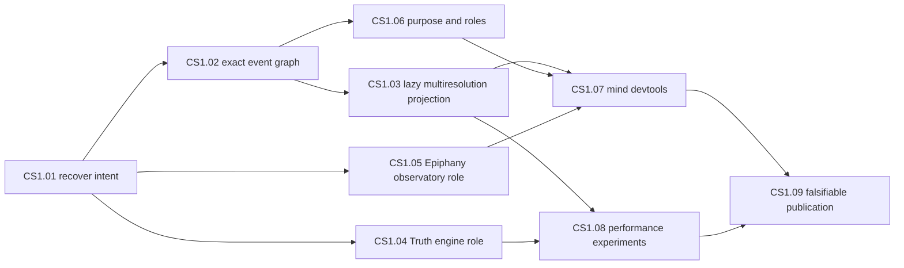

# EPIC: Make the Foresight cognitive substrate testable, scrutable, and purpose-driven

## Epic user story

**As a** researcher/operator building Foresight,\
**I want** the persistent cognitive substrate expressed as an event-sourced,
dynamically projected system with explicit human purpose,\
**so that** I can test whether it actually improves agent behavior, inspect why
actions happened, and explain what I am building even if the hypothesis fails.

## Why now

Several prototypes contain parts of the idea but present narrower identities:
Fork Tales captured much of the graph/stigmergic behavior in an exploratory
prototype; OpenPlanner was an earlier attempt; Truth currently presents strongly
as a game/simulation; Epiphany presents strongly as archaeology. The intended
system is larger than any of those surfaces, but that intention should not be
promoted into architecture merely because it feels coherent.

This epic turns the idea into falsifiable stories. It treats the raw causal
event graph as exact evidence, projected simulation state as potentially
approximate, and LLM calls as recruited deliberative tools rather than the whole
persistent intelligence.

## Core hypothesis

A persistent, event-driven semantic graph with propagating signals, fields,
reinforcement/decay, environmental feedback, and demand-driven resolution may
provide a more responsive, persistent, and scrutable substrate for agent
behavior than repeatedly reconstructing all purpose and state inside isolated
LLM turns.

That is a research hypothesis, not an accepted fact.

## Design laws to test

- Raw human, agent, tool, and environment events remain exact, immutable, and
  causally traversable.
- Simulation/projection state may aggregate or approximate, but it cannot erase
  the evidence that produced it.
- Resolution is event/demand driven rather than requiring a global wall-clock
  tick.
- Distant or low-influence state may be aggregated Barnes-Hut style; nearby or
  decision-relevant state is promoted and resolved explicitly.
- Goals and user stories are first-class representations of purpose.
- Presence, attention, role, capability, authority, and action are distinct.
- Generated mathematics is not evidence by appearance; every equation needs an
  operational interpretation, invariant, simulation, or falsifying experiment.

## Children

1. `CS1.01` — recover the intended substrate from the prototype lineage.
2. `CS1.02` — preserve the raw causal event graph as exact ground truth.
3. `CS1.03` — project lazy multiresolution dynamics over the full graph.
4. `CS1.04` — evaluate Truth as a reusable throughput-oriented simulation engine.
5. `CS1.05` — evaluate Epiphany as a broader cognitive observatory, not archaeology only.
6. `CS1.06` — represent purpose, stories, roles, and bounded authority as first-class state.
7. `CS1.07` — build "devtools for a mind": causal traces and multiscale visualization.
8. `CS1.08` — benchmark dimensions, vectorization, GPU suitability, and dynamics empirically.
9. `CS1.09` — publish a falsifiable research narrative whether the hypothesis wins or fails.

The 31-point total is the sum of the child estimates. The stories are planning
contracts; implementation is admitted separately through the owning repository.

## Dependency shape

## Definition of done

This epic is complete when the repository contains a revision-bound,
experimentally exercised model that can explain:

1. what raw evidence entered the system;
2. what exact causal lineage was preserved;
3. what state was aggregated or approximated and why;
4. what goal/story caused deliberation or action to be recruited;
5. what observable behavior followed;
6. whether the measured result supports, weakens, or falsifies the hypothesis.

A negative result is a valid completion outcome. "It feels brain-like" is not.

## Triage

Priority and urgency are intentionally left for operator triage. They are not
inferred from the intensity of the design conversation.
