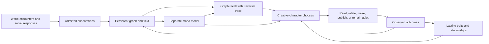

# OpenHax as a creative character: recovered intent and memory drift

License: GPL-3.0-or-later.

## Status and scope

This is an observed source map, a derived diagnosis, and a provisional delivery
design. It is not a claim that character, mood, graph physics, or social agency
has been implemented or deployed. The current runtime was inspected without
starting an agent, restarting a maker, changing contracts, or publishing.

The preceding [always-on outcome](2026-10-06-cephalon-always-on.md) and
[operational evidence](../verification/cephalon-always-on-20261006.md) remain
valid within their recorded limits. This note recovers the next product shape;
it does not turn the earlier scheduling/publication work into proof of memory
continuity. The existing epic is `25e3a688-09b5-4e9a-8765-9b13944b1a00`.

## Recovered human intent

The October 7 human steering supplies the following requirements directly:

> He needs some outside information.

> I want him to be interacting with memory through the graph.

> The graph has to physically work the way we talk about it in other places.
> Like in the fork_tales experiment.

> He is a character. He is an actor playing a role. His role is a creative person.

The user also names feed reading, liking, commenting, following, unfollowing,
an independent presence, evolving personality, and mood as a separate model.

**Derived invariant:** encounters must change the character's persistent state,
that state must change what he notices and recalls, and those changes must
become visible in his choices and work. Identity and the creative role persist
across the maker, conversation, and social facets. Personality evolves slowly;
mood changes on a shorter timescale. Both have causal evidence.

The product needs a closed loop:

The native fifteen-minute clock remains the creative scheduling authority.
Continuous intake and inexpensive field updates can run between opportunities.
A clock turn consumes actual changed state; it should not repeatedly substitute
the same task instructions for encounters. The historical proposal to remove
all LLM timers is an earlier design proposal, not authority to replace this
deployment's explicitly selected clock.

## Observed source map

The paths below are actual local sources inspected on October 7. External
checkouts are evidence donors, not code automatically admitted to Foresight.

| Anchor | What it actually says or implements | Epistemic tier |
| --- | --- | --- |
| [Promethean Eidolon fields](/home/err/devel/orgs/octave-commons/promethean/docs/design/fields/eidolon-fields.md:7) | Local tension, charge, gradients, history, and changing attention; emotion and habit are described as field patterns. | Observed historical design |
| [Nooi](/home/err/devel/orgs/octave-commons/promethean/docs/design/nooi.md:26) | Field cells retain local pressure, charge, trails, and binding sites; particles both read and change the field. | Observed historical design |
| [Duck's attractor states](/home/err/devel/orgs/octave-commons/promethean/docs/hacks/notes/ducks-attractor-states.md:133) | Outside inputs and self-reflection feed a persistent feedback buffer, changing operational modes. | Observed historical interpretation, not a measured affect model |
| [Fork Tales corrections](/home/err/devel/orgs/octave-commons/fork_tales/docs/notes/system_design/2026-02-20-design-hole-responses-field-and-collisions.md:14) | Decaying sparse fields, probabilistic paths, flexible intent bonds, immutable emitted ownership, seed/mantle/intent embeddings, and different friction for presences, nexus, and daimoi. | Observed design clarification |
| [Fork Tales runtime](/home/err/devel/orgs/octave-commons/fork_tales/part64/code/world_web/daimoi_probabilistic.py:439) | Contains actual semantic-force and collision machinery, with separately tested graph/presence/nooi surfaces. | Observed source; not live verification here |
| [Cephalon MVP](/home/err/spaces/foresight/openplanner/packages/agents/cephalon/packages/cephalon-cljs/docs/notes/cephalon/cephalon-mvp-spec.md:18) | Memories derive from events, carry provenance and links, and share identity/preferences across session facets. | Observed historical design |
| [Eidolon retrieval notes](/home/err/spaces/foresight/openplanner/packages/agents/cephalon/packages/cephalon-cljs/docs/notes/cephalon/cephalon-eidolon-field-concept.md:25) | Stable content vectors and contextual vectors coexist; nexus keys support associative expansion. | Observed historical proposal |
| [Daimoi retrieval notes](/home/err/spaces/foresight/openplanner/packages/agents/cephalon/packages/cephalon-cljs/docs/notes/cephalon/cephalon-daimoi-v01.md:1) | Bounded walkers expand semantic seeds through structural neighborhoods and retain reasons. | Observed proposed approximation |
| [Event-native engagement](/home/err/spaces/foresight/openplanner/packages/agents/cephalon/packages/cephalon-ts/docs/event-native-engagement-spec.md:1) | Feed intake, novelty, social timing, live field change, and action grounded in actual encounters. | Observed proposal; its timer replacement is not selected for the current deployment |
| [CLJS mood tool](/home/err/spaces/foresight/openplanner/packages/agents/cephalon/packages/cephalon-cljs/src/promethean/tools/self.cljs:21) | Returns a `self.set_mood` action map. The searched cephalon sources contain its declaration/registration but no matching state transition consumer. | Observed bounded source search |
| [TS field](/home/err/spaces/foresight/openplanner/packages/agents/cephalon/packages/cephalon-ts/src/mind/eidolon-field.ts:16) | An in-memory map of eight keyword-driven counters, with decay applied on ingestion. | Observed donor implementation |
| [TS local graph](/home/err/spaces/foresight/openplanner/packages/agents/cephalon/packages/cephalon-ts/src/mind/local-mind-graph.ts:31) | Persists nodes/edges and increases encounter weights; exposes channel/link summaries. | Observed donor implementation |
| [Knoxx hydration](/home/err/spaces/foresight/knoxx/backend/src/cljs/knoxx/backend/infra/agent/hydration.cljs:102) | Triggered keyword-based conversational recall, vector retrieval, authorization filtering, and a short prompt snippet. | Observed implementation; same path inspected at served revision `2644fc6` |
| [Knoxx memory/graph clients](/home/err/spaces/foresight/knoxx/backend/src/cljs/knoxx/backend/infra/openplanner/memory.cljs:268) | `memory_search` uses vector search; `graph_query` is a separate graph-memory request. | Observed implementation |
| [OpenPlanner graph memory](/home/err/spaces/foresight/openplanner/src/routes/v1/graph.ts:4496) | Vector seeds, bounded cost traversal, force/trail inputs, semantic reinforcement and persisted daimoi trails. | Observed source; this query can write feedback |
| [Knoxx Bluesky tools](/home/err/spaces/foresight/knoxx/backend/src/cljs/knoxx/backend/domain/bluesky/bluesky.cljs:356) | Existing timeline, likes/unlikes, follows/unfollows, notifications, thread access, and replies through publication. | Observed source; live maker permissions differ |

There is relevant affect/field material. This investigation did not establish a
complete, deployed, separately trained mood model hidden elsewhere. The named
historical formulations also differ: the older Eidolon note describes scalar
tension gradients, while the later Fork Tales clarification describes deposited
sparse vector winds. Those representations need an explicit reviewed mapping;
their shared vocabulary does not establish mathematical identity.

## Actual deployment evidence

The observation transcript is
[native-memory-observation.json](../../.ημ/review-evidence/cephalon-character/20261007-native-memory-observation.json).
It is a transcription of selected command output, not a raw provider response.

Served identity remains `knoxx-backend:social-local-2644fc6-creative`, image
`sha256:ce0123ef17bade99603ea6ea19967c99c62869118d1cf52c057ab6a72500bf14`.
The read-only diagnostic passed all 12 checks, retained seven warnings, and
verified the 240 contract hashes. Its sampled active list was empty; this is a
timed observation, not an ownership reservation. Native music failures remain
visible even when a cycle also saves/publishes other work.

The deployed maker contract has passive memory `enabled? true`, `mode triggered`,
`k 6`. Its allowed tools cover creation, local files/bash, own publication,
profile/author-feed reads, Discord send, and delegation. It does not expose
`memory_search`, `memory_session`, `graph_query`, timeline, like, follow, or
unfollow. Replies through `bluesky.publish` are technically possible, but this
does not establish a discovered-conversation loop.

The responsive head has memory hydration disabled and denies heavy memory,
graph, feed, and maker tools. That narrowing served responsiveness. A future
shared character snapshot can feed the head without placing expensive discovery
or traversal on its acknowledgment path.

Eight maker runs admitted from `09:52:25.751Z` through `11:37:25.338Z` were
inspected. Each persisted `memoryHydration.mode = triggered`, an empty `hits`
array, and elapsed time between 791 and 1447 ms. Their native tool receipts
contain no memory, graph, or social discovery tool invocation. This observation
does not exclude public feed reads performed inside bash or continuity in the
sticky session. It proves that the inspected automatic retrieval supplied no
memories and those runs did not explicitly traverse the graph.

At `11:47:22.090Z`, the local store had 9,950 events, 3,017 event chunks,
12,838 graph edges and 6,544 graph-node embeddings. At a subsequent bounded
metadata read, all 3,017 event chunks belonged to source `knoxx`, project
`knoxx-session`; there is no basis to call the database empty. The inspected
semantic field cells, force samples, semantic edges, daimoi trails, edge claims,
and compacted vectors each had zero records.

Two read-only memory API queries returned HTTP 200: a short artwork/music query
returned three hits at `11:48:54.124Z`; replaying the latest persisted hydration
query under the diagnostic API principal returned six hits at `11:49:43.426Z`.
The runtime selected the direct Mongo client. These reads neither reproduce the
maker's original authorization context nor freeze the earlier corpus, so they
do not identify a proven causal bug. They narrow investigation to the automatic
path, its scope, filters, and index timing. The repair must retain authorization,
not use an administrative principal to make the empty result disappear.

## Where implementation drifted

| Intended relationship | Observed substitution or disconnection | Required correction |
| --- | --- | --- |
| Outside encounters change future behavior. | The live task is dominated by repeated production instructions and fallback recipes. Its allowed surface lacks timeline/notification/relationship operations. The Fork Tales composer role also mandates a recurring motif vocabulary. | Separate the durable creative role from production recipes; admit outside evidence and route it into state and recall before choices. Keep lore as a chosen lens, not a compulsory motif for every output. |
| Same character across facets. | Identity/persona lives mainly in role prompts and sticky session history. The inspected field is a separate donor runtime, not an established shared state path in served Knoxx. | Bind a stable presence identity to maker, head, and social facets, with one reconstructible character-state projection. |
| Mood changes independently and causally. | `self.set_mood` returns a declaration; the TS field implements keyword bumps, in-memory storage, and ingestion-count decay. | Admit observations/appraisals into a separate mood transition model with time, persistence, validation, and a trace of contributing events. |
| Graph memory is used in thinking. | Actual passive hydration uses vector search; the live maker cannot invoke the separate graph tool. All eight sampled automatic hydrations returned no memories. | Test capture -> scoped graph seeds -> traversal -> context inclusion -> changed choice under the actual maker principal. |
| Retrieval changes the field and graph over time. | Donor local graph weights are encounter counters; current local field/trail/force collections are empty. OpenPlanner implements some feedback in a graph query that these turns do not call. | Consume the existing graph seam deliberately and prove feedback/replay. Count evidence of useful recall, separately from retrieval frequency. |
| Physical graph and field are causal. | The deterministic nexus-walk proposal and cost-based graph fill are narrower approximations than Fork Tales' moving nexus, intent bonds, sparse winds and particle interaction. | State which mechanics are preserved and implement their effects on actual recall/action state. A visualization or a renamed search is not conformance. |
| Character continuity outlives context windows. | The CLJS context assembler has a pinned-memory TODO; the live window limit/sticky history is not a persistent trait model. | Keep event history, graph projection, mood/trait projection and temporary context as distinct layers. |
| Social presence includes changing relationships. | Social adapters exist in Knoxx, but the maker's live allowlist mainly exposes publishing and profile/author-feed access. | Wire bounded discovery and reversible relationship actions into the same identity, graph, mood, and outcome loop. |

These are evidence-supported reductions and integration gaps. They do not
identify the motivation of a particular prior agent. Relevant preserved history
includes OpenPlanner's April 17 extraction `3e7c8c5`, May graph snapshots
`0bec078`, `a381bea`, `4b1b737`, and Knoxx's later hydration changes. Those are
recovery strata, not proof that the older full design ever ran in this deployment.

## Provisional model boundaries

### Presence, role, personality, mood, and attention

| Model | Authority and timescale | Inputs and outputs |
| --- | --- | --- |
| Presence identity | Stable identity; separate from display name, role, session, and credential principal. | Owns character continuity and links authorized platform identities. `discord_automation` is currently a credential-bearing actor; it is not sufficient evidence of a unique character-state key. |
| Creative role | Durable purpose/lens, subject to explicit operator changes. | Makes taste and craft meaningful; available skills and tools remain explicit capabilities. |
| Personality/relationships | Slow projection from accumulated episodes, with supporting evidence and uncertainty. | Interests, aesthetic preferences, habits, affinities, commitments, and relationship history influence future selection. One response or one like does not rewrite a trait. |
| Mood | Separate evolving model; fast relative to traits. | Prior state, actual elapsed time, admitted encounters, appraisals and outcomes -> new state plus attribution. Biases attention, sociability and expression. |
| Attention/intent | Short-lived focus. | Mood, traits, field pressure, invitations, novelty and unfinished work -> the next bounded action or silence. |
| Memory graph and field | Rebuildable projections over immutable evidence. | Preserve structural bonds, contextual salience, observations, state changes, recall traces and action outcomes. |

The mood model has its own contract, state, version and invocation budget.
A small interpreter model may propose appraisals of encounters; validated pure
transitions own state updates. Sharing model weights with the maker is compatible
with a separate mood model, but sharing one unstructured prompt/state blob is
not. Whether a distinct set of weights improves appraisal is an experiment, not
a prerequisite for causal separation.

An initial human-readable mood projection could expose energy, tension,
openness, playfulness and social appetite. These coordinates are provisional
diagnostics, not a replacement claim for the eight-field mechanics. Each update
records prior state, event/appraisal IDs, elapsed time, model/config revision,
seed when sampling, and resulting state. Mood can affect a choice; it cannot
expand permissions or override publication/lifecycle admission.

### Memory and physical graph contract

1. **Observations remain evidence.** Store source identity, actual observation
   time, external immutable identity, content hash, visibility and provenance.
   Own outputs have a different source classification from outside encounters.
2. **Bonds have meaning and intent.** Authorship, reply, inspiration, relationship,
   contradiction, summarization, and explicit pinning remain identifiable.
   Typed evidence relationships can project into the single nexus-bond topology
   described by Fork Tales without becoming separate competing force engines.
3. **Geometry participates in the computation.** Selected physical coordinates,
   velocities, mass/friction, elastic bond parameters, and sparse field state
   update through a bounded solver. Presentation coordinates are a projection;
   drawing a force layout does not update character cognition by itself.
4. **Daimoi move and leave traces.** Emission has an immutable owner and seed;
   movement samples local field, semantic attraction, bond constraints and
   recorded exploration noise. Deposit, decay, absorption/deflection, and
   intent exchange produce attributed events. The later clarification about
   ownership supersedes the earlier formalism's permissive owner handoffs.
5. **Recall uses the resulting state.** Stable semantic seeds locate memories;
   the character's current field/lens and bonds affect bounded traversal and
   inclusion. Preserve canonical content embeddings when the state-conditioned
   lane changes. Recall returns node IDs, actual path, reasons and state revision.
6. **Effects return to memory.** Observed response, completed artifact and
   publication outcome attach to their actual inputs/choices. Retrieval alone
   is not proof that an association was useful. An unresolved or failed effect
   remains unresolved or failed in both evidence and character state.
7. **Replay is the physical acceptance test.** With identical initial state,
   admitted event sequence, solver/config revision, timestep schedule and random
   seed, field evolution and traversal are reproducible within a declared numeric
   tolerance. Different outside inputs must be capable of changing them.

This requires recovering the smallest portable laws from the existing graph and
Fork Tales donors, then consuming them through reviewed adapters. It does not
authorize copying a second Python runtime, introducing a new database, or
silently assigning common actor/graph law ownership by vocabulary.

### Outside input and social life

The intake facet reads the authenticated feed, replies/mentions, chosen people,
threads, and a small changing set of external sources. It retains cursors,
deduplicates external IDs, classifies self-output separately, and attaches
people/topics to the graph. Feed foraging can follow an existing interest and
occasionally explore a recorded new direction. It should not demand a post or
artwork on every intake event.

The social facet can like, reply, follow, unlike and unfollow through existing
Knoxx adapters, under the character's configured account. A choice records the
encounter, current state, reason, external target and resulting record identity.
Unfollow/unlike must bind the character's own prior record; the existing deletion
helpers require their actual record URI. Notification outcomes and changed feed
composition feed back into relationships and mood. A mood fluctuation alone
should not cause repeated follow/unfollow oscillation.

The next creative opportunity can be grounded in a recent encounter and an
older association, or continue a chosen project. It records which memories and
state mattered. Novelty checks compare subject, source, medium and structure as
well as repeated words; randomized adjectives or temperature are insufficient
evidence of changing interests. External text is evidence, not tool authority.

## Concrete delivery sequence and falsification cases

1. **Restore actual character recall first.** Compare automatic retrieval and
   direct retrieval with the same query, corpus revision and maker principal.
   Trace input -> raw candidate IDs -> quality filtering -> visibility filtering
   -> included memory IDs. A test must fail when stored authorized memory exists
   but automatic hydration silently delivers none. A denied cross-actor memory
   must remain denied. Add a graph-mediated recall case, not only vector search.
2. **Recover and test the coupled graph/field mechanics.** Prove sparse deposit,
   elapsed-time decay, seeded exploration, different friction, intent bonds,
   collision ownership, and resulting traversal changes. A display-only layout,
   unaffiliated walk, or a trail count without causal influence must fail.
3. **Add separate mood and slow character projections.** Duplicate/reordered
   events, restart/replay, quiet-time decay, contradictory appraisals and
   concurrent facets have explicit behavior. Invalid or missing appraisal
   cannot invent an encounter; traits require repeated supported episodes.
4. **Wire intake and relationship choices.** Fixture feeds include duplicates,
   self-posts, changed cursors, empty/failed feeds, removed targets, and actual
   own follow/like record identities. No outside input and no meaningful state
   change cannot pass as novelty. Account effects remain idempotent and bounded.
5. **Verify the complete character loop.** Two different admitted encounters
   alter mood/graph recall and materially change choices under a fixed seed;
   replay restores the same character across head/maker/social facets. Human
   inspection verifies the resulting work and interactions, separately from
   transport/tool success. Confirm the responsive head still acknowledges while
   intake, traversal, appraisal and creation occupy their own bounded lanes.

This is a planning handoff. Proposed slices above need canonical planning review
and lawful Rheos readiness before implementation laws/tests in RED and
domain/adapters in GREEN. It adds no card status, frontmatter, transition, board
writer, or substitute review policy. Existing reviewed guarantees and pending
music packaging work retain their own gates.

## Ownership and verification boundaries

- Knoxx composes the current character/product, resource contracts, permitted
  tools, context and social/media adapters. Its new pure decisions should use
  `.cljc` where practical, with CLJS adapters and JS interop at extern boundaries.
- OpenPlanner supplies the existing event/vector/graph storage and query seams.
  Its Mongo client currently handles vector operations locally while graph
  operations delegate to the REST client. Readability of local vectors does not
  prove graph transport, scoped traversal or feedback delivery. Also,
  `/graph/memory` can reinforce edges and persist trails; diagnostic inspection
  must not call it a pure read or trigger feedback accidentally.
- Fork Tales and historical Promethean/Cephalon provide recovery evidence and
  candidate laws. Shared-law promotion and runtime ownership require their own
  reviewed decisions; names such as Eidolon/graph/actor do not grant authority.
- Clio/identity/runtime/contract seams retain their declared authority. Existing
  credential principals and privacy boundaries are preserved.
- No source, contract, model routing, runtime owner, PM2 service, cloud event
  consumer, board state, or social record was changed for this investigation.
  No new review, provider credit, deployment, or Git head advancement occurred.

The initial recovery deliverable is this diagnosis and its selected evidence.
The subsequent active implementation goal preserves the whole character loop;
the automatic hydration discrepancy is its first repair target.

## Implementation planning and authority follow-up

The full loop now has a manually authored incoming
[epic](../agile/kanban/cephalon-character-epic.md), with seven child stories:

| Story | Proposed points | First acceptance target |
| --- | --- | --- |
| [Scoped graph recall](../agile/kanban/cephalon-character-recall.md) | 5 | Actual scheduled actor authority, allowed memory inclusion and a traced graph neighbor; hidden paths stay denied. |
| [Encounter intake](../agile/kanban/cephalon-character-intake.md) | 3 | Changing outside observations, durable cursors and provenance, deduplicated independently from self-output. |
| [Physical field coupling](../agile/kanban/cephalon-character-physical-field.md) | 8 | Recovered motion/bonds/deposits/collisions change actual recall and reproduce under replay. |
| [Separate mood](../agile/kanban/cephalon-character-mood.md) | 5 | Versioned independent mood changes attention/recall, with elapsed time, causal inputs and bounded appraisals. |
| [Character continuity](../agile/kanban/cephalon-character-continuity.md) | 5 | Stable presence and evidence-supported slow traits/relationships survive pruning, restart and concurrent facets. |
| [Social choices](../agile/kanban/cephalon-character-social.md) | 5 | Grounded account-scoped likes/replies/follows/unfollows with idempotent effects and observed outcomes. |
| [Complete loop proof](../agile/kanban/cephalon-character-loop-verification.md) | 3 | Paired-input/replay and independently observed qualified deployment prove every link. |

The 34-point sum is provisional. Incoming metadata and proposed dependency UUIDs
are first-class Markdown input, not a native transition, admitted estimate or
claim of installed graph admission. Existing reserved-head, publication,
terminal-owner/recovery and lifecycle stories remain explicit predecessors for
the relevant social/deployment slices. No earlier review approval transfers to
this changed planning scope.

Further read-only native observations narrowed the recall discrepancy. The
`12:07:25.415Z` maker run records actor `discord_automation`, role
`discord-source-synthesizer`, no organization/membership/user, an empty permission
list, non-admin state and zero hydration hits. Both the event authority builder
and the turn's fallback synthesis carry actor/role/policies without resolving
stored memory grants.

Selected **actual served-source** visibility forms were executed with controlled
fixture contexts. Actor-only contexts fail for both legacy and organization-
scoped sessions; a matching owner succeeds, an explicit cross-session grant
allows legacy sessions, and a foreign organization remains denied. The nil-
context bypass is a separate existing branch, not a proposed repair. These
results establish an authorization barrier on the current maker path, while
allowing that other retrieval/indexing problems may coexist. The earlier eight
turns were not each replayed with frozen vector candidates.

The retained [authority evidence](../../.ημ/review-evidence/cephalon-character/20261007-event-memory-authority.json)
names the native timestamps, served revision, source hashes, selected real
functions and fixture results. It also records the initial wrong-collection
query as an operator failure with no verification credit. The repair must resolve
the actual trusted actor scope, enforce privacy before traversal/feedback and
demonstrate final graph context inclusion; setting context to nil/admin would
preserve a different end state.

## Planning-review prerequisite correction

CodeRabbit completed full review `5442414707` on `4f1ad49d0cb9990e5a3b8b4374ab193ce9b477c7`
and raised two verified planning findings: dependency admission had no delivery
owner, and the physical-field kernel/numeric selection had no explicit task.
The epic now tracks the existing upstream Rheos gap and personal PR as the
separately owned admission prerequisite, with an installed identity and native
positive/negative verification requirement. Proposed UUIDs remain proposals
until that gate works.

The [kernel/numeric selection task](../agile/kanban/cephalon-character-field-contract.md)
adds an explicit proposed predecessor to solver/replay work. The coordinator
owns publishing the selection; its reviewed decision must name the actual owning
kernel and numeric contract. It adds 3 provisional planning points to the seven
original delivery stories' 34, for a proposed total of 37. Existing frontmatter
is preserved; a lawful native re-estimate remains separate from content review.
These corrections establish reviewable prerequisites, not their delivery,
readiness or implementation.

### Stored principal follow-up

A read-only, whitelisted native directory projection at `2026-10-07T12:48:36.670Z`
found one active `discord_automation` membership, in active `open-hax`, with an
active user and role `discord-user`. Its joined stored permission count was zero;
it had no `agent.memory.cross_session` grant and no system-admin role. The query
read only directory status and role/permission flags, not credentials or emails.
The retained transcript is
[stored-actor-authority](../../.ημ/review-evidence/cephalon-character/20261007-stored-actor-authority.json).

Resolving this stored principal can restore organization/owner scope, but cannot
invent cross-session access to the legacy corpus. The first repair must verify
which owned/shared memories that principal may use, preserve foreign/private
denials, and make any missing grant a separately reviewed authorization change.
The candidate source already separates stored actor binding from display
fallback and has an actor-membership resolver that refuses ambiguous matches;
that is an existing integration seam, not a live repair or permission grant.
