# The Promethean review and promotion loop

The conversation is part of the work. A musing connects existing documents,
code, services, cards and observations; it becomes an epic and small stories,
then an artifact reviewers can argue with. Review turns a plausible frame into
a decision with evidence. Laws and tests make the decision executable.

This is the same transduction loop behind Epiphany's recovered claims,
Calliope's creative review and Knoxx's product surfaces. Those names identify
use cases and ownership; they do not make every implementation interchangeable.

## Current decisions

The October 3 request changes reviewer admission: invite **all available agents**,
with CodeRabbit, Codex, MiMo and Kimi as intended targets, but require **one eligible approving review on the exact current
head**. A formal GitHub `APPROVED` review or an explicit completed passing /
“no issues” verdict can satisfy this rule. Verify the eligible reviewer identity
and the current commit coverage from the actual provider record; a generic green
status or a comment that merely acknowledges the request cannot qualify.
All required deterministic checks and findings settlement still apply.
A stale approval, acknowledgement, skipped review, quota error, timeout or
partial result cannot satisfy the approval requirement. A review that later
requests changes supersedes its earlier approval. An optional worker failing
must remain visible; it must not become a fabricated green provider check.

The global skill pack remains `riatzukiza/.agents` PR #8: `pr-muse-connect`,
`pr-sprint-planning`, `pr-red-green`, `pr-review-settlement`,
`pr-review-to-merge`, and `pr-flow`. The graph belongs in that repository; this
root records constellation policy and integration requirements. The user's
latest available-agent and cap correction retains all four invitation targets;
unavailability does not remove an agent from that roster. Canonical
`~/.agents/skills/pr-flow` owns availability evidence, current-head available-cohort
convergence and mandatory reviewer overrides. This root imposes no local hard
round cap. Required reviewers/checks and every findings-settlement obligation
remain mandatory; historical counts and receipts keep their original context.
This prospective clarification installs or activates no policy or service.

The target process uses `{feat,chore,docs,fix,...}/*` in the mapped personal fork.
It activates per repository only after mapping, protection, trusted admission
and staging orchestration are implemented and verified. The existing authorized
PR path remains in force until that activation; this planning PR does not
change remotes or enable a controller.
Open a draft while preparing artifacts; when an installed reviewer cannot read
drafts, make it ready with auto-merge off. Planning review settles scope,
acceptance, estimates and dependencies before Rheos moves the stories to ready.
Then run red laws/tests, implement pure domain logic and outward adapters, and
settle every implementation finding with a cited fix, deferral or rejection.
P0/P1 requires verified correction. Merge the qualified head with a merge commit.

## Development, staging, promotion

```mermaid
flowchart LR
  M[Musing and linked evidence] --> P[Epic and stories]
  P --> R[Planning review and Rheos ready]
  R --> T[Red laws and tests]
  T --> G[Green domain and adapters]
  G --> Q[One current-head approval plus required checks]
  Q --> F[Personal fork main merge]
  F --> S[Trusted Services staging job at merge SHA]
  S --> E[Deployment and behavior evidence]
  E --> O[In-org promotion PR]
  E --> I[Affected Foresight integration PR]
  O --> C[Org checks and current-head review]
  C --> U[Org merge and protected fork sync PR]
  U --> X[Terminal sync receipt and reflection]
```

A qualified **feature** merge in an activated fork requests DigitalOcean staging through the trusted
Services controller. PR code builds in an ephemeral sandbox with no deployment
or signing credentials. The staging controller receives immutable artifacts,
source SHA and verified review/check evidence, rechecks admission, and emits a
separate deployment receipt. This replaces the earlier plan's implication that
only an org merge starts staging. Each application keeps its existing branch
and production policy until its reviewed migration is activated.

After staging succeeds, open or reuse `promote/<full-40-hex-sha>` **inside the
org** for the receipt-bound fork merge X. Existing branches/PRs must match X;
a collision or conflicting binding is rejected, never overwritten. An in-org
PR does not isolate secrets. Its candidate workflows, builds and dependency
hooks also run with read-only tokens and without deployment or signing secrets.
Privileged operations use a trusted external App or base-pinned workflow that
never checks out or executes candidate code; protected-environment approval may
add an operator gate. Neither `pull_request_target` nor a familiar check name
grants trust to candidate code. GitHub documents this
[same-repository PR risk](https://docs.github.com/en/actions/concepts/security/compromised-runners).

The required admission context is bound to an expected App identity and an
independently pinned gate implementation/configuration. It validates source
repository, PR head, qualified fork merge X, artifact digest, staging receipt
ID/hash and trusted issuer. A manually opened `promote/*` PR must satisfy the
same proof; branch naming or reachability alone is insufficient. Both fork and
org main forbid direct writes and bypass, force pushes and deletion. Read back
classic protection and active applicable repository/inherited rulesets.

Require strict up-to-date checks or a merge queue. Qualification records the
base SHA and tested merge candidate; a later base change invalidates that
combination and requires fresh merge-candidate checks. New PR heads require
fresh review evidence. This follows GitHub's
[protected-branch contract](https://docs.github.com/en/repositories/configuring-branches-and-merges-in-your-repository/managing-protected-branches/about-protected-branches).
Sync org main back into the protected fork with a `sync/<full-org-sha>` PR;
never force-push either main.

The controller validates an admitted origin/purpose record: `feature` may
request staging, `upstream-sync` is terminal after its qualified merge and
reflection, and unknown purposes are rejected. Sync merges request no staging,
promotion or Foresight integration. The trusted App's reconciliation record
binds purpose, repositories, PR and exact SHAs; a branch prefix or editable
label cannot supply this authority. Duplicate-event keys alone cannot prevent
a loop whose successive sync merges have new SHAs.

The Foresight PR updates only mapped, affected gitlinks after the child commit
is reachable from its approved destination and the successful staging receipt
covers that exact gitlink X. If an org merge creates Y, it proves X reachable
from Y; it cannot silently substitute Y for staged X. A desired Y gitlink needs
its own exact staging proof. The PR records the receipt ID/hash, issuer and
upstream PR rather than claiming that every submodule was redeployed. A GitHub
App reconciliation loop opens missing PRs idempotently; duplicate merge events
must not create duplicate deployments or promotion PRs.

## Server execution before an interactive app

The first server slice is a persistent MiMo/Kimi worker service. Actions can
prepare deterministic evidence and submit a signed, immutable job, then stop
waiting for inference. A short status reconciler publishes progress and final
results from durable records; the Actions job's exit does not stand in for the
model review. Hosting removes the Actions job lifetime from inference; it does
not remove provider quota, network stalls, resource limits or cancellation.

Use the existing design in
[eta-mu-github-evidence-workflow.md](design/eta-mu-github-evidence-workflow.md)
and its [graph](design/eta-mu-github-evidence-workflow.edn). Eta-mu coordinates
admission and publication, Sol owns process/provider execution, Knoxx exposes
job status, findings, retry/cancel and evidence queries through authenticated
API contracts, Clio admits immutable event records, Katamorph declares their
shapes, and Services owns hosting. Mongo protocol records may index/project
these resources; database rows do not replace admitted Clio records. EDN is the
portable default artifact for Sol, with transport/storage adapters at the edge.

Knoxx mutating job endpoints require Axxium principal, installation, repository
and actor bindings or an explicit operator scope. Authentication alone does not
authorize another repository's job. Status/read, cancel and retry have separate
permissions; cancellation is idempotent and retries receive a new immutable
attempt identity. Cross-principal/repository denial is an activation fixture.

Reuse `knoxx.promethean.rest` as the declared public ingress and preserve its
existing routes. The repository's GitHub namespace scaffolding is currently
**disabled**, not an active webhook receiver. A deployment needs a separately
reviewed service slot, persistent state, health probe, publisher credential
boundary and verified route before it can be described as hosted.

Read-only host inspection on October 3 reached `open-hax-services-production`
through the existing `knoxx` SSH alias. An OpenCode headless server and eta-mu
Muse daemon were active under user systemd, alongside the existing Knoxx
production containers and a separate pm2 dev checkout. This is reusable hosting
capacity, not evidence that review jobs are admitted or published there. The
Services runtime directory listing was denied to the SSH user; controller
placement must be verified through its authorized owner before mutation. No
process, container or route was restarted or changed.

Next, add the eta-mu-ai GitHub App's signature-verified webhook intake and periodic
reconciliation. The app acknowledges deliveries promptly, pins the observed
head, deduplicates delivery/job/publication identities, and rejects stale
publication. Restart replay, stale-head races, duplicate events and incomplete
worker results are required fixtures before activation. A review model never
gets the App signing key or permission to decide its own green check.

## CodeRabbit access and evidence

Checked against current official documentation on October 3:

- Public repositories below ten stars require manual review requests. Following
  the user's latest request-renewal correction, deduplicate pending exact-head
  requests; an unacknowledged request remains pending. Renew only after the
  actual attempt is terminal and any observed cooldown is known to have expired.
  An unknown cooldown needs operator attention. Canonical pr-flow owns that
  evidence and lifecycle; acknowledgements cannot supply completion or approval.
  Never automatically activate paid/on-demand review credits.
- OSS allowance is scoped per repository as well as per developer; another
  repository's footer does not establish this PR's reset time.
- Personal subscriptions do not grant org-repository subscriptions. Native PR
  review and CLI review are distinct channels with distinct evidence.
- Agentic API keys authenticate the headless CLI and select their billing
  organization. The CLI rejects User API keys. No documented general User-key
  PR-review REST API was found in this investigation.
- CLI remote review requires the repository to be installed in that key's
  organization. Local committed review can supply separate evidence; it must
  record the compared base/head, completion outcome, exit code, file coverage,
  tool version and artifact digest. `review_skipped`, a failed outcome or
  unreviewed files cannot be converted into approval.

The local Agentic-key probe authenticated CLI **0.8.2** in an isolated auth
home and reported **5 of 5** included reviews available. The release archive was
verified against its published SHA256SUMS before extraction. Keys remain outside
Git. A real committed deep CLI review of this PR at `b6b75f8` then completed with
exit0, full17-file coverage and one minor shell-placeholder finding, corrected
in the follow-up. Its artifact digest and base/head binding are recorded in the
review-operation receipt and PR comment. This proves a usable local CLI review
channel; it does not prove a hosted worker, remote org access, or native GitHub
review publication.

Sources: [plans](https://docs.coderabbit.ai/management/plans),
[headless authentication](https://docs.coderabbit.ai/cli/headless-cli-integration),
[CLI evidence contract](https://docs.coderabbit.ai/cli/reference),
[personal/org licensing](https://kb.coderabbit.ai/articles/4057404869-how-does-coderabbit-licensing-work-when-i-have-both-a-personal-account-and-organizations-under-my-git-provider).

## Implementation ledger

| Surface | Evidence and current scope |
| --- | --- |
| Review restoration | eta-mu #339, Muse #17 and caller PRs repair existing Actions reviewers; merge qualification remains live and exact-head. |
| Skill graph | .agents #8 contains the pack; quorum and request-lifecycle changes are being implemented there. |
| Fork map | riatzukiza/foresight #1 has the map law; creation, protection and promotion stories remain separately qualified work. |
| Fork process | Foresight #122 contains this policy and its incoming stories; documentation does not claim activation. |
| Hosting | Existing coordination card `4f5cb66d-4fd2-47cf-92cc-2185b057a889` and disabled Knoxx GitHub resources define the seams; runtime activation remains pending. |

See [promethean-pr-process.edn](design/promethean-pr-process.edn) for the proposed
integration graph and explicit implementation status. Board state stays under
Rheos; this change edits prose and adds first-class Markdown inputs, without
inventing transitions or board validation.
