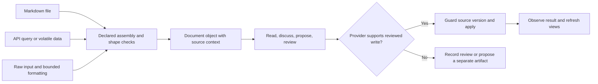

# Signal

(汝, p=1.00) The selected first workflow is: open a document, discuss it, and review an edit. The broader product direction includes hosting documentation, projecting boards, holding design-document conversations, and rendering research and reports. The October 3 clarification makes the product a content management and review system: most content will be Markdown files, but compatible providers may supply document-shaped maps from volatile data, API queries such as GitHub issues/PRs, or raw inputs requiring formatting. Those inputs need not become stored Markdown files.

(己, p=0.96) Proposed product statement: **Rheos is a content management and review workspace over document objects assembled under explicit shape contracts.** Reading, discussion, proposals, and review form a tight feedback loop. Where a provider supports editing, that loop includes guarded application of a reviewed change. Markdown is the primary source format and first adapter; frontmatter is one representation of metadata. Boards, documentation, designs, research, and reports are views over participating content.

(己, p=0.97) This corrects the product framing now. Additional provider implementations are follow-on work; their possibility must shape the first interface without requiring them all in the first release. This revision supersedes the brief's earlier Markdown-only framing. The existing filename is retained so references continue to identify the same evolving brief.

## Source, document object, and view

(己, p=0.96) A source provider supplies content and source facts. A declared assembly maps that input into a document object satisfying the applicable laws. A renderer presents that object. These are distinct boundaries: a GitHub issue rendered as Markdown still belongs to GitHub; a formatted API response does not acquire a Git history or become an editable file merely because it looks like one.



| Proposed provider | Source authority | Representation and retention | Editing behavior |
| --- | --- | --- | --- |
| Markdown in a workspace/repository | Owning file/repository | Original text plus parsed metadata/body; source history remains with its owner | Reviewed edits preserve untouched source and check the actual base |
| GitHub issue/PR or query result | External API; entity and query-result identities differ | Validate the response, assemble a document map, render it; caching or retention is explicit | Read/review initially; source mutation requires a separately qualified adapter |
| Volatile compatible data | Declared live provider | Observation time, coverage and freshness are visible; payload may remain ephemeral | Review the observed result; refreshing produces a new observation |
| Raw input requiring formatting | Declared input source | Versioned transformation supplies a valid document representation with provenance | Formatting is a derived view; publishing a new artifact or editing a source is a separate operation |

(己, p=0.96) Compatibility means satisfying the declared input, assembly, and document contracts needed for a capability. The exact schema identities and assembly rules are to be resolved against existing Alpha/Katamorph and Epiphany contracts. This brief does not introduce a second universal document schema or assume that all providers support the same commands.

## The first user-visible loop

1. Open an existing Markdown document, including one without board frontmatter. See both the source and rendered reading view through the common document interface.
2. Start a conversation attached to the actual source observation being discussed, including its content identity and revision where available. Make selected context and references visible.
3. Produce a proposed edit with an inspectable diff and explanation. Generating a proposal leaves the source untouched.
4. Review, reject, or accept the edit. Acceptance applies exactly the reviewed change only if the source still matches its reviewed base.
5. See the updated document, the discussion, and the recorded decision together. For this durable Markdown slice, reopening or restarting retains the source reference and review provenance. Other providers follow their declared retention policy.

(己, p=0.96) This first loop requires a provider-neutral read boundary, a source-preserving Markdown adapter, source-bound discussion, a proposal/diff, review, and conflict handling. GitHub queries, live providers, raw-input formatting, public hosting, and richer report views can then be added as independently qualified capabilities. Their adapters do not require whole-corpus classification, a graph layout, automatic consolidation, or arbitrary reactions before the first loop is useful.

## Proposed domain contracts

- A document object is a contracted map, not a synonym for a file. Its source reference identifies the provider and the entity, query, or input it represents. Filesystem paths and Git fields belong to the Markdown/Git adapter; they are not required of every provider.
- Separate entity identity, read/observation identity, source version, content digest, and observation time. A query is not one of its returned entities; a digest is not semantic identity; a timestamp is not an immutable revision. A provider without reproducible versions must expose that limitation rather than invent a Git revision.
- Assembly is explicit and versioned: applicable input shapes, field/block mappings, transformations, output shapes, and provenance are inspectable. Validate both sides of replaceable boundaries. Formatting or parsing produces derived data; it does not establish truth, acceptance, persistence, or write authority.
- Provider capabilities are explicit: readable representations, full/partial coverage, refresh/freshness, reproducibility, retention, and supported mutations. A valid read-only document participates in discussion and review without receiving an edit button or an implied write protocol.
- A Markdown source reference identifies its owning repository/root, exact raw path, and actual revision or working-tree content identity. Committed Git identity and modified working-tree content identity are distinct. A proposal reviewed against a working-tree observation must check those bytes, not only HEAD.
- Existing task UUIDs remain canonical task identity. A general document can be opened without receiving a task UUID, workflow status, or a universal frontmatter schema. Profile/facet validation is additional participation, not a prerequisite for reading every file.
- Markdown/text-source adapters preserve original source text. Unchanged frontmatter, body, comments, quoting, newlines, and extension fields survive a targeted edit. Other adapters preserve the source fields, structure and provenance required by their declared contracts. Parsing data for queries does not authorize reserializing the entire document through a card serializer.
- A conversation records the source observation, assembly version, and selected context it used. A section or field selection is bound to that observation; it is not silently reinterpreted after a source change or reformatting.
- A proposal carries its target, base observation/version, proposed change, explanation, and source/context references. A review decision is distinct from accepting a mutation, the write attempt, and the observed write result. Reviewing an API result may only evaluate it; creating a report from it names a separate target.
- An accepted edit names the actor, decision, source before and after, and the actual result. Duplicate acceptance cannot apply the change twice. Rejecting or closing a proposal leaves the source unchanged.
- A detected source change or refresh invalidates affected current views and pending proposals. Expiry or unknown freshness is visible when a provider cannot signal change. A stale proposal remains inspectable but cannot overwrite a newer external edit.
- The source comparison and write belong to one owned application boundary. The Markdown filesystem adapter must define how it detects or excludes a change between comparison and commit; a check made when the preview opened is insufficient. Each later write adapter must qualify its own source-version guard rather than inheriting this guarantee from rendering compatibility.
- Content retention is separate from review-record retention. Reading, discussing, or provisionally reviewing a volatile payload does not require persisting it. A retained decision records its target, criteria, disposition, and basis; exact source references, digests, observation time, query context and transformation version are retained as appropriate. Credentials are not recorded. Promoting a claim to accepted requires sufficient preserved evidence: bounded capture or a durably reproducible source basis. If neither is available, the claim remains provisional or needs investigation. This is conditional evidence preservation for acceptance, not permanent storage of every live payload. A digest alone cannot reconstruct the payload.
- Document maturity, evidence state, and task workflow status remain separate. A reviewed design is not automatically an implemented feature, and a done card is not proof that its document claims are current.

# Evidence

## Source scope

(己, p=0.99) Foresight was inspected at b03805b0b87e5c7e9a628b0efa1fab61a066f20a. Its Rheos gitlink is uninitialized in this checkout. Remote Rheos main was inspected separately at 11811264a308d406cb612aefa1dad40818675e5e, which matches that recorded pin. Available donor eta-mu is at 0ed56aa74a53a1d1e9c2e55ce95451817a7f3a90. A temporary Rheos checkout supplied source inspection and one pure parser probe; no installed/deployed Rheos service, browser loop, or complete test suite was verified in this research turn.

(己, p=0.99) The October 3 correction inspected the initialized, clean Epiphany checkout at ca3fd843b30ef8fd9ca2881aeb9758e58dac6b66. Its draft policies, identity designs, Markdown contracts/parser, and adapter boundaries were read. No Epiphany runtime or test suite was executed, and no child repository or board state was changed.

(己, p=0.99) Epiphany remote HEAD was also inspected at 643be698ea0d841dd19385506b272872306e456e. The cited document-governance, research, review-and-acceptance, ADR-000 and artifact-identity documents, plus the Markdown law/parser, are byte-for-byte identical to the local pin. Citations retain that reproducible local revision.

## Promethean: what the completion claims actually proved

| Episode | Observed record | Interpretation and limit |
| --- | --- | --- |
| October 12, 2025 MCP completion | The report declares 17 configured tools and all-tools readiness, but displayed backend checks cover board access, search, and count. It also says the MCP server cannot start and defers protocol integration testing. | (己, p=0.98) Configuration and a few read paths became whole-product readiness. This is a claim/evidence mismatch, not proof of a later regression. [Report](https://github.com/octave-commons/promethean/blob/06a8b83312ea70dcde6d2e423369b410e6d0d3f2/docs/hacks/inbox/kanban-mcp-completion-report.md), [Drive copy](https://drive.google.com/file/d/1UqZOq-izEU6yasgnlD_si421GeNMU26B/view). |
| October 12–27 transition history | An enforcement report treats a known logging/cache issue as nonblocking. Later root-cause evidence identifies an empty cache file and lost history. The repair replaces writing an empty file at the directory path with directory creation. October 22 extraction had preserved the faulty code. | (己, p=0.97) A latent persistence defect survived structural work. Task movement and durable transition history were different capabilities; success in one did not prove the other. [Initial report](https://github.com/octave-commons/promethean/blob/06a8b83312ea70dcde6d2e423369b410e6d0d3f2/docs/hacks/inbox/kanban-process-enforcement-report-2025-10-12.md), [root cause](https://github.com/octave-commons/promethean/blob/91f8e8bec862763f9d01ebb604caaf0400085546/.serena/memories/kanban_tracking_root_cause_analysis.md), [repair](https://github.com/octave-commons/promethean/commit/9edf22627c1ea53238dd6add0828d6e51ea41bb0), [extraction](https://github.com/octave-commons/promethean/commit/213ef7306bf39e9e4b797516a8712b8d4c290594). |
| October 11–26 AI task mutations | The testing changelog names mock TaskAIManager flows; MCP registers analyze/rewrite/breakdown. A later production-blocker task reports hardcoded task reads and missing real writes. Historical source corroborates fake reads, log-only writes, and a backup pathname without file creation. | (己, p=0.97) Tests demonstrated mocked control flow, while real Markdown persistence remained unproved. This is a missing production boundary, not a claim that mocks themselves are inappropriate. [Testing record](https://github.com/octave-commons/promethean/blob/06a8b83312ea70dcde6d2e423369b410e6d0d3f2/changelog.d/2025.10.11.18.00.00.md), [blocker](https://github.com/octave-commons/promethean/blob/06a8b83312ea70dcde6d2e423369b410e6d0d3f2/docs/agile/tasks/6859f9a9-fix-taskai-manager-mock-cache.md), [source snapshot](https://github.com/octave-commons/promethean/blob/302bce3cc28167c2fee9a7fa67c87e60ead7c705/packages/kanban/src/lib/task-content/ai.ts). |
| October 28 API removal and restoration | A commit removes public analyzeTask/rewriteTask/breakdownTask methods while introducing compliance work; a subsequent commit restores them fourteen minutes later. | (己, p=0.98) A source-proven API regression. No executed failure log was found establishing which user invocation failed. [Removal](https://github.com/octave-commons/promethean/commit/302bce3cc28167c2fee9a7fa67c87e60ead7c705), [restoration](https://github.com/octave-commons/promethean/commit/5b9c896a51bf3f7ed41d33be9c661992e66ef15b). |

(己, p=0.96) The shared lesson is that a capability becomes dangerous when a later feature assumes more than its tests established. The evidence supports both real regressions and previously untested defects. Those have different causes and must stay distinguishable.

## Recovered product intent

- (汝, p=0.99) On August 13, the user proposed generalizing Rheos for arbitrary Markdown/frontmatter/structure and document-driven work. The preserved response proposed Artifact → Event → Reaction and a board as one projection. The note is a draft, not proof of implementation. [Historical note](https://github.com/open-hax/foresight/blob/b03805b0b87e5c7e9a628b0efa1fab61a066f20a/docs/notes/generalizing-rheos-artifact-event-reaction.md).
- (汝, p=0.99) September 12's document-corpus epic proposes document reading, typed relationships, revision-checked proposals and edits, external-editor observation, and consistent board/chat/document views. Its status is proposed. E2.10 already specifies a thin document-centered workspace slice. [Repository epic](https://github.com/open-hax/foresight/blob/b03805b0b87e5c7e9a628b0efa1fab61a066f20a/docs/migrations/eta-mu-breakdown/epic-02-rheos-document-corpus.md), [Drive epic](https://drive.google.com/file/d/1rL5zHEb5Kn619Ctw5qHR07A0M8gZRz7f/view), [Writing User Stories](codex://threads/6aa57b08-eb18-83ea-9e71-0208b32934af).
- (己, p=0.99) Current Alpha contains portable Artifact/Relation/Event/Reaction and lossless-Markdown shapes plus profile/facet machinery. These are structural contracts, not a general Rheos reader, editor, publication service, or authorization implementation. [Artifact law](https://github.com/open-hax/foresight/blob/b03805b0b87e5c7e9a628b0efa1fab61a066f20a/alpha/src/alpha/law/artifact.cljc), [profile code](https://github.com/open-hax/foresight/blob/b03805b0b87e5c7e9a628b0efa1fab61a066f20a/alpha/src/alpha/law/markdown/profile.cljc).

## Epiphany: the broader document model already described

| Recovered distinction | Evidence and limit |
| --- | --- |
| Assembly into a reviewable artifact | (世, p=0.99) Document governance describes λ as document form + bounded content + provenance + relations + status → governed artifact. It explicitly allows that design to exist before every parser/checker is executable. [Governance transformation](https://github.com/octave-commons/epiphany/blob/ca3fd843b30ef8fd9ca2881aeb9758e58dac6b66/docs/process/document-governance.md#L22). |
| Documents extend beyond Markdown files | (世, p=0.99) The draft covers durable Markdown and structured records, including generated views, templates, examples, and analysis findings. Scratch captures, imports and temporary investigations need not meet every current template. [Scope](https://github.com/octave-commons/epiphany/blob/ca3fd843b30ef8fd9ca2881aeb9758e58dac6b66/docs/process/document-governance.md#L40). |
| Research can have several representations | (世, p=0.99) A source record uses a stable locator/identity, version or observation context, source type, access time, authority assessment and availability. Research artifacts may be files, controlled sections, structured records or generated views. [Research artifact set](https://github.com/octave-commons/epiphany/blob/ca3fd843b30ef8fd9ca2881aeb9758e58dac6b66/docs/process/research.md#L83). |
| Shape, projection, and authority differ | (世, p=0.99) Structural checking is separate from semantic judgment. A generated view is a projection, not canonical source. Review/verification records and accepted decisions have different responsibilities. [Principles](https://github.com/octave-commons/epiphany/blob/ca3fd843b30ef8fd9ca2881aeb9758e58dac6b66/docs/process/document-governance.md#L56), [kinds](https://github.com/octave-commons/epiphany/blob/ca3fd843b30ef8fd9ca2881aeb9758e58dac6b66/docs/process/document-governance.md#L102). |
| Review targets evidence in context | (世, p=0.99) The review contract names target/version, criteria, evidence, reviewer/authority, disposition and limitations. A status, successful command, merge or generated report is not acceptance alone. [Review contract](https://github.com/octave-commons/epiphany/blob/ca3fd843b30ef8fd9ca2881aeb9758e58dac6b66/docs/process/review-and-acceptance.md#L15). |
| Storage is selective | (世, p=0.98) ADR-000 proposes source-owned Git bytes, operation-specific evictable caches, and selective preservation. This supports separating content availability, caches and durable review decisions; it does not choose a retention rule for every live API source. [Data boundary](https://github.com/octave-commons/epiphany/blob/ca3fd843b30ef8fd9ca2881aeb9758e58dac6b66/docs/adrs/adr-000-authoritative-data-boundary.md#L13). |
| Concrete Markdown maps already exist | (世, p=0.99) The parser takes a string and constructs a typed map containing a raw frontmatter block with spans, body blocks and UTF-8 source length. The current document law is Markdown-specific; it is not a generic decoded frontmatter map or a general API provider contract. [Parser](https://github.com/octave-commons/epiphany/blob/ca3fd843b30ef8fd9ca2881aeb9758e58dac6b66/src/epiphany/shape/markdown.clj#L232), [document shape](https://github.com/octave-commons/epiphany/blob/ca3fd843b30ef8fd9ca2881aeb9758e58dac6b66/src/epiphany/law/markdown.clj#L110). |
| Existing adapter discipline is reusable | (世, p=0.99) Storage ports are injected maps of named functions; the contracts validate data flowing through them. This is an implemented adapter pattern, not an implemented document-provider/assembly registry. [Ports](https://github.com/octave-commons/epiphany/blob/ca3fd843b30ef8fd9ca2881aeb9758e58dac6b66/src/epiphany/law/ports.clj#L1). |
| Non-Git authority was deferred | (世, p=0.99) Phase-one identity design limits the source universe to Git repositories. Its decision inventory explicitly leaves API responses, datasets and other non-Git sources unresolved. That bounds the old implementation; it does not make Git a universal requirement for the corrected Rheos product. [Phase-one identity](https://github.com/octave-commons/epiphany/blob/ca3fd843b30ef8fd9ca2881aeb9758e58dac6b66/docs/designs/artifact-identity-model.md#L12), [open authority question](https://github.com/octave-commons/epiphany/blob/ca3fd843b30ef8fd9ca2881aeb9758e58dac6b66/docs/designs/phase-1-decision-status.md#L43). |

(己, p=0.98) The connection to Rheos is explicit in the August Foresight synthesis: it uses Epiphany's document-governance policy as design evidence for generalizing Rheos around artifacts, events and reactions, with Markdown as an adapter. E2 later proposes Epiphany as the historical/evidence analysis participant in a Rheos document workflow. These are integration proposals. Epiphany's draft process policies and current Markdown machinery do not establish a deployed general content engine or accepted common law for every provider. [Generalization](https://github.com/open-hax/foresight/blob/b03805b0b87e5c7e9a628b0efa1fab61a066f20a/docs/notes/generalizing-rheos-artifact-event-reaction.md#L122), [E2 boundaries](https://github.com/open-hax/foresight/blob/b03805b0b87e5c7e9a628b0efa1fab61a066f20a/docs/migrations/eta-mu-breakdown/epic-02-rheos-document-corpus.md#L25).

(己, p=0.97) Existing Alpha provides the broader open Artifact/Ref/Relation shapes. Markdown-specific profile code projects declared frontmatter paths into artifact fields. Generic provider observations, freshness/capability contracts, and assembly recipes still need their precise contract ownership and integration qualified; neither Alpha nor Epiphany currently supplies that whole Rheos capability. Keep new shared semantics pure and portable where practical, with acquisition, filesystem/API writes and rendering in outer adapters. [Alpha kernel and boundary](https://github.com/open-hax/foresight/blob/b03805b0b87e5c7e9a628b0efa1fab61a066f20a/alpha/README.md#L18).

## Current Rheos gaps relevant to this loop

| Capability | Source evidence at the inspected Rheos revision |
| --- | --- |
| File reading | (己, p=0.97) MCP project_read returns capped raw content and a truncation indicator, but no content revision or document identity. A complete, revision-bearing read is needed for reviewed edits. [Reader](https://github.com/open-hax/rheos/blob/11811264a308d406cb612aefa1dad40818675e5e/src/rheos/backend/infra/agent_tools.cljs#L34). |
| Browser reading and rendering | (己, p=0.98) The UI opens cards by UUID. Their body sections render through marked and DOMPurify; no general-document opener was found. This reader infrastructure can be reused after its content contract is widened. [Selection](https://github.com/open-hax/rheos/blob/11811264a308d406cb612aefa1dad40818675e5e/src/rheos/ui/domain/layout.cljs#L109), [rendering](https://github.com/open-hax/rheos/blob/11811264a308d406cb612aefa1dad40818675e5e/src/rheos/ui/domain/sidebar.cljs#L204). |
| Document-bound conversation | (己, p=0.98) UI chat is deliberately decoupled from task selection and sends message/session data without a document revision. Its Rheos adapter keeps IDs in memory and returns empty history. Persistence in an external conversation service was not audited. [Layout](https://github.com/open-hax/rheos/blob/11811264a308d406cb612aefa1dad40818675e5e/src/rheos/ui/domain/layout.cljs#L145), [chat adapter](https://github.com/open-hax/rheos/blob/11811264a308d406cb612aefa1dad40818675e5e/src/rheos/ui/infra/chat_session.cljs#L37). |
| Proposals and reviewed application | (己, p=0.97) No document proposal/diff/acceptance model or expected-source-revision check was found in the inspected paths. Existing card edits write immediately, followed by event emission. A write-id correlates watcher events; it does not guard a reviewed base revision. [Task edits](https://github.com/open-hax/rheos/blob/11811264a308d406cb612aefa1dad40818675e5e/src/rheos/backend/infra/task_edit.cljs#L17), [HTTP routes](https://github.com/open-hax/rheos/blob/11811264a308d406cb612aefa1dad40818675e5e/src/rheos/backend/infra/http_server.cljs#L300). |
| Source preservation | (己, p=0.99) A pure parser probe lost nested frontmatter/list/multiline information and altered spacing around a fenced YAML delimiter: input 186 characters, output 145 after adding a priority field. Existing roundtrip assertions compare a small parsed subset, not byte preservation or all metadata. [Parser](https://github.com/open-hax/rheos/blob/11811264a308d406cb612aefa1dad40818675e5e/src/rheos/backend/shape/content_parser.cljs#L5), [roundtrip test](https://github.com/open-hax/rheos/blob/11811264a308d406cb612aefa1dad40818675e5e/test/rheos/backend/shape/content_parser_test.cljs#L136). |
| External changes and open-view freshness | (己, p=0.97) The watcher observes projected card additions/changes under task roots and emits nothing for a file without an explicit frontmatter UUID. Unlink produces no event. SSE refetches the board; the open card sidebar does not reload solely because an external change occurred. General-document freshness requires its own behavior without admitting all prose as tasks. [Watcher](https://github.com/open-hax/rheos/blob/11811264a308d406cb612aefa1dad40818675e5e/src/rheos/backend/infra/watcher.cljs#L101), [refresh logic](https://github.com/open-hax/rheos/blob/11811264a308d406cb612aefa1dad40818675e5e/src/rheos/ui/domain/layout.cljs#L86). |
| Write authority | (己, p=0.96) No application-level actor write-authority check was found in the current HTTP/MCP mutation paths. A future chosen actor boundary remains proposed. The first local loop can use explicit human acceptance under configured workspace permissions; it need not introduce a general identity subsystem. [HTTP mutation route registry](https://github.com/open-hax/rheos/blob/11811264a308d406cb612aefa1dad40818675e5e/src/rheos/backend/infra/http_server.cljs#L300). |
| Durable stores | (己, p=0.99) Cards are files, event admission uses an EDN ledger, and saved board queries use an EDN store. No document proposal/review store or SQLite store was found. This does not establish the persistence capabilities of external Sol/Knoxx services. [Ledger](https://github.com/open-hax/rheos/blob/11811264a308d406cb612aefa1dad40818675e5e/src/rheos/backend/infra/ledger.cljs#L1), [view store](https://github.com/open-hax/rheos/blob/11811264a308d406cb612aefa1dad40818675e5e/src/rheos/backend/infra/view_store.cljs#L6). |
| Verification surface | (己, p=0.95) Filesystem mutations, watcher handler calls, projection isolation and CLI refusal have tests. HTTP/MCP transport, browser and restart tests were not found in the standalone source inventory. Standalone has no .github workflow directory; donor CI declares a Rheos lane. No whole-suite pass is claimed here. [Donor CI](https://github.com/open-hax/eta-mu/blob/0ed56aa74a53a1d1e9c2e55ce95451817a7f3a90/.github/workflows/rheos.yml#L80). |

### Reproducing the preservation failure

(己, p=0.99) Run this pure probe from the inspected Rheos checkout, with nbb available. It mutates no files or board state. The test adds a priority field; changing the whole string is therefore expected. The defect is loss of unrelated nested/multiline metadata and changed fenced-body spacing.

```bash
nbb -cp src -e '(require (quote [rheos.backend.shape.content-parser :as p])) (let [raw "---\nuuid: doc-1\nstatus: incoming\nmetadata:\n  author: Someone\n  links:\n    - docs/a.md\nsummary: |\n  Line one\n  Line two\n---\n\n# Document\n\nParagraph.  \n\n```yaml\n---\nexample: value\n---\n```\n\n" result (p/update-frontmatter raw "priority" "P0")] (prn {:before-frontmatter (:frontmatter (p/parse-frontmatter raw)) :after-frontmatter (:frontmatter (p/parse-frontmatter result)) :input-characters (count raw) :output-characters (count result) :nested-author-preserved? (clojure.string/includes? result "  author: Someone") :multiline-value-preserved? (clojure.string/includes? result "  Line one") :body-output (:content (p/parse-frontmatter result))}))'
```

Observed source-probe result:

```clojure
{:before-frontmatter {:uuid "doc-1" :status "incoming" :metadata "" :summary "|"}
 :after-frontmatter {:uuid "doc-1" :status "incoming" :metadata "" :summary "|" :priority "P0"}
 :input-characters 186
 :output-characters 145
 :nested-author-preserved? false
 :multiline-value-preserved? false
 :body-output "# Document\n\nParagraph.  \n\n```yaml\n\n---\nexample: value\n---\n\n```"}
```

# Frames

(己, p=0.95) Three complementary views explain the product direction:

1. **Content and presentation:** documentation, designs, findings, research, reports and compatible external data become readable document objects through declared assembly and rendering. Storage is one provider concern.
2. **Conversation and review:** discussion binds to observed content and produces explicit proposals and scoped decisions. Mutation is available only where its target provider supports it.
3. **Work coordination:** selected document facets participate in Rheos workflow and board projections; dependent work consumes verified capabilities.

(己, p=0.96) Responsibility proposal: each source provider retains its own authority, availability and mutation semantics; Git repositories retain bytes/history for Git-backed content. Rheos owns its content/review commands and views; Chat UI supplies conversation primitives; Epiphany supplies historical/evidence analysis; Osmos can supply acquisition and bounded jobs; Clio supplies admitted immutable event semantics; Alpha/Katamorph supply reusable shapes and pure laws. E2's responsibility division applies to its Git-backed corpus migration; this broader model generalizes the input boundary without rewriting that scoped epic. This remains a proposed integration, not evidence that all these components are connected today.

(己, p=0.96) The wider hosting/reporting direction can reuse the first loop: documents and reports use the reader; design conversations use the observation attachment; boards use their existing task facet and FSM. A report assembled from API results can be a generated view or an explicitly published artifact, with different retention and source authority. Public hosting, richer rendering, additional providers, graph exploration, and reactions are later capabilities after the common document/review boundary is dependable.

# Countermoves

## Proposed verification contract

(己, p=0.97) Markdown read/discuss/edit/recovery scenarios qualify the selected first slice. Non-file admission is a fixture for the common boundary. Live refresh, production raw-input formatting, and external-provider writes are follow-on capabilities, qualified when their adapters are implemented; the table does not require those integrations in the first release.

| Scenario | Required observable result |
| --- | --- |
| Open an ordinary document without board metadata | The full admitted source is readable and renderable without silently turning it into a task. |
| Supply a read-only API-shaped fixture without path, Git revision or frontmatter | Common read/review admission accepts it under its declared contracts; file/card fields are not universal requirements. This is a boundary fixture, not a claim of a delivered GitHub adapter. |
| Supply malformed or unsupported input/assembly output | Applicable shape errors or explicit unsupported diagnostics remain visible; rendering success is not substituted for valid assembly. |
| Refresh a volatile result | A new observation is shown with its freshness/coverage; the old conversation is not silently rebound. Exact replay availability follows the declared retention policy. |
| Discuss a selected source observation | The discussion names the actual source and assembly context; switching documents does not silently rebind old messages. |
| Preview or reject a Markdown edit | Original bytes remain unchanged; a proposal/decision remains inspectable. |
| Accept a Markdown body edit | Only reviewed text changes; unknown/nested frontmatter, comments, fences and unaffected formatting survive. |
| Change the Markdown source externally before acceptance | Application is refused as a conflict; the newer source is preserved and refreshed review is available. |
| Review or render content from a provider without source-write support | Review can record a disposition; rendering or accepting a judgment does not write back or fabricate an editable file. |
| Format raw input into a document view | Declared transformation versions and source context accompany a valid output; source facts and derived presentation remain distinguishable. |
| Attempt an edit without human acceptance or outside configured write permissions | Reading the document does not authorize applying a proposal. The first local slice enforces explicit human acceptance and its configured workspace boundary; richer actor-policy integration is separately proposed. |
| Repeat acceptance or retry after interruption | No duplicate application; actual partial/completed results are distinguishable and recoverable. |
| Reload or restart the Markdown slice | Source content, discussion attachment, decision and before/after provenance remain available. A volatile provider instead refreshes or reports expired/unavailable content according to its policy; retained decisions do not imply retained payloads. |
| Read through another supported transport | CLI/API/MCP/UI agree about the observation, supported capabilities and applied outcome they expose. |
| Exercise the existing board fixture | UUID, lifecycle, comments, transition refusal and the event ledger remain lawful through Rheos. |

(己, p=0.96) Keep the failing cases next to the real boundary they exercise. Root orchestration consumes Rheos behavior; it does not add a competing board parser, serializer, transition validator, or command surface. Reuse shared pure law/assembly fixtures under their proper owner. Use a small fixture set: a plain design document, a research/report document with nested frontmatter and fenced content, an existing card, a volatile API-shaped map, and raw input with a declared formatting transform. The non-file fixtures qualify the common boundary without demanding production connectors in the first slice. Deterministic provider doubles establish bounded behavior; a real-provider/browser walkthrough separately qualifies an integrated workflow.

(己, p=0.96) For every dependent capability, state what has actually been qualified: source helper, file persistence, installed entry point, browser path, restart recovery, or real provider. Bind results to the tested revision and configuration. Failed or unavailable checks remain visible. A green mock test or registered tool never inherits the evidence of an unexecuted transport or persistence path.

(己, p=0.95) The content write and its durable record are separate failure boundaries. Qualify both and the recovery between them; an edit can succeed while event recording fails. The product must expose that partial result instead of reporting a fully recorded acceptance. This directly addresses the old transition-history failure.

(己, p=0.97) Keep proposed designs separate from current implementation and accepted common law. The historical generalization note, E2 epic, and this brief are proposals. Current Alpha behavior is executable structural machinery; its existence does not silently accept every recovered cross-repository claim. [Promotion-status distinction](https://github.com/open-hax/foresight/blob/b03805b0b87e5c7e9a628b0efa1fab61a066f20a/docs/notes/project-law-promotion-status-triage.md).

# Next

(己, p=0.96) Define and qualify the common document-read boundary using a source-preserving Markdown observation and a read-only API-shaped fixture without file/Git fields. That one contract slice establishes the provider distinction before attaching discussion and reviewed edits.
